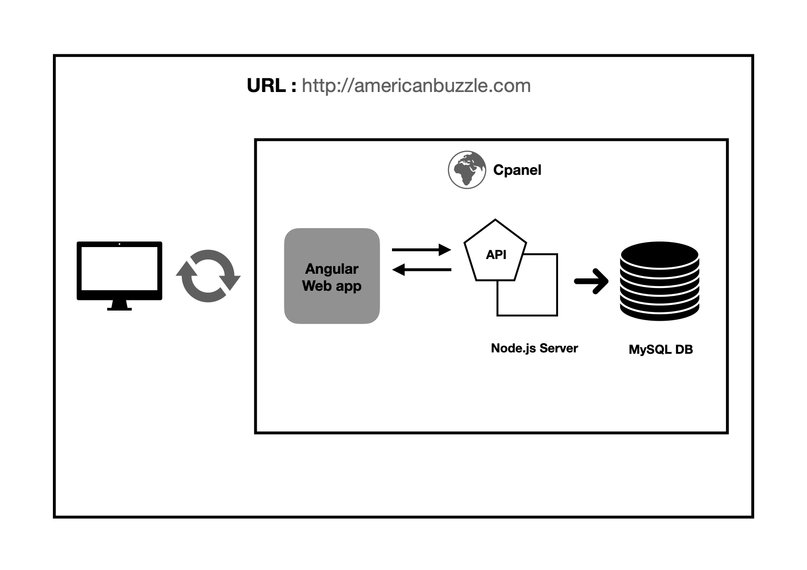

<h3 align="center">:white_check_mark: :construction:&ensp;&ensp;Work Completed&ensp;&ensp;:construction: :white_check_mark:</h3>
<h1 align="center">Americanbuzzle Web Application</h1>

```rust

Application URL : http://americanbuzzle.com/

```

<h2>License</h2>

<p>Licenses this source under the <u>MIT License</u>,You may not use this file except in compliance with the License.</p>
<!-- Badges -->
<p align="left">
  <a href="LICENSE.md">
    
  </a>
</p>


<h2>Content&ensp;&ensp;:book: :book:</h2>

<ul>
    <li>Angular 10 web app</li>
    <li>Node JS Express server</li>
    <li>MySQL DB</li>
</ul> 


  [](https://nodejs.org/en/)
  
  
  [](https://angular.io/)

  
<h4 align="center">Here is a screenshot of the Architecture Design</h4>
<!-- image -->
<p align="center">

</P>
